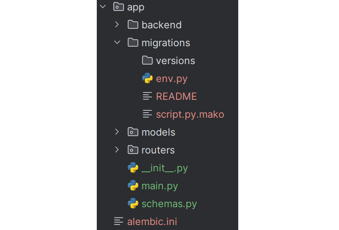
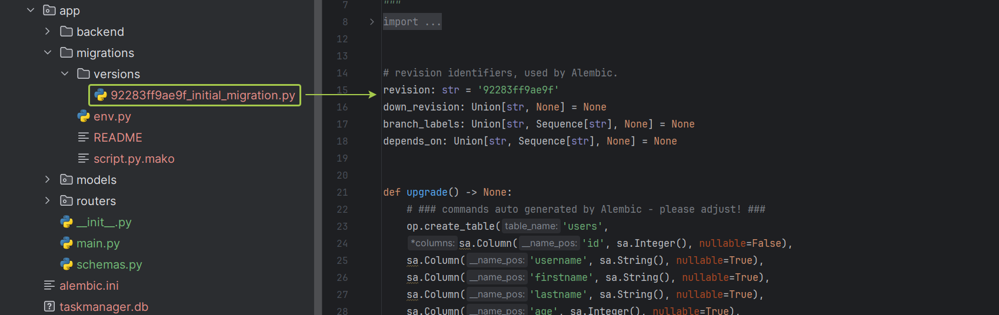
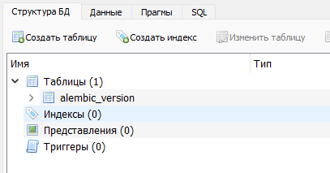
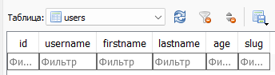
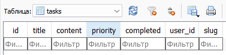
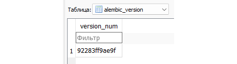

# HomeWork-3-Modul-17
# Домашнее задание по теме "Миграции. Библиотека alembic."
Цель: усвоить новые правила структурирования проекта с использованием FastAPI. Научиться создавать миграции и подтверждать их при помощи alembic.

Задача "Миграции alembic":
Установите все необходимые библиотеки для дальнейшей работы: alembic.
Инициализируйте alembic, у вас должна получится следующая структура:

3. Укажите адрес вашей базы данных 'sqlite:///taskmanager.db' в alembic.ini
4. В env.py импортируйте модели Base, User и Task. Целевой укажите Base.metadata
5. После чего сгенерируйте первую миграцию при помощи alembic revision. Должна появится версия миграции и база данных:

6. Откройте появившуюся базу данных в DB Browser, создастся только 1 таблица - для версий миграций:

7. Выполните команду alembic upgrade head, которая позволит вам применить последнюю миграцию и создать таблицы User, Task и запись текущей версии миграции:

Таким образом вы создадите базу данных и 3 реальных таблицы, с данными которых сможете работать в след. домашних заданиях.
